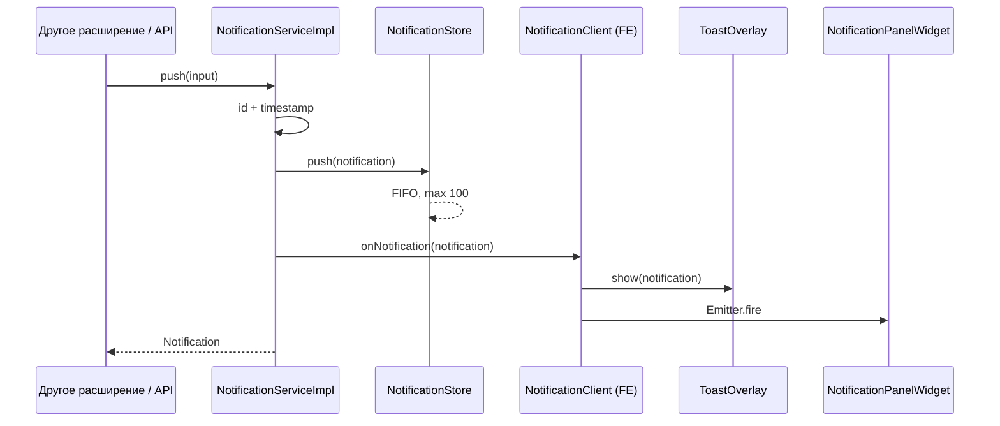
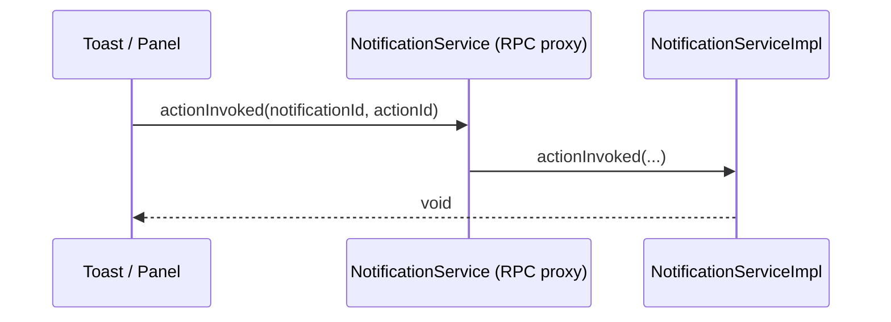
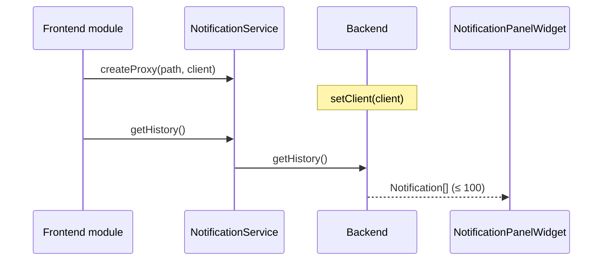

# Архитектура: Notification Center

Theia-расширение: backend публикует типизированные уведомления, frontend показывает toast и историю в боковой панели.

Контракт между процессами живёт в `shared` и не зависит от DOM или Node.js. Frontend и backend общаются только через JSON-RPC Theia (WebSocket), без отдельных HTTP/WebSocket-каналов.

## 1. Цели

- Типизированный RPC-протокол, общий для frontend и backend.
- Мгновенный push уведомления на клиент.
- История последних 100 записей (in-memory, FIFO).
- Toast + панель истории с фильтрами и действиями.
- Корректное освобождение подписок при dispose виджета / разрыве RPC.

## 2. Стек технологий

Расширение живёт внутри Eclipse Theia: язык, DI, RPC, виджеты и сборка берутся из фреймворка, без параллельного стека.

| Назначение | Технология | Где используется |
|---|---|---|
| Язык | TypeScript (strict) | все слои |
| Фреймворк | Eclipse Theia, `@theia/core` | расширение целиком |
| Runtime backend | Node.js ≥ 22 | `backend/` |
| Runtime frontend | Browser / Electron renderer | `frontend/` |
| DI | InversifyJS через `@theia/core/shared/inversify` | backend- и frontend-модули |
| Связь процессов | Theia JSON-RPC поверх WebSocket | `shared` протокол, proxy/handler |
| UI | React 18 + `ReactWidget` Theia | панель, toast overlay |
| Виджеты / layout | Lumino (через `@theia/core`) | sidebar, вкладки |
| Стили | CSS, темы Theia | иконки severity, анимация toast |
| Сборка | `tsc` + Theia CLI | `lib/` и бандл приложения-хоста |
| Пакетный менеджер | npm | зависимости расширения |
| Unit-тесты | Jest, `*.spec.ts` | store / service в `backend/` |
| E2E | Playwright + `@theia/playwright` | toast, панель, фильтры, RPC round-trip |
| Линт | ESLint (конфиг в духе Theia) | все `.ts` / `.tsx` |
| CI/CD | GitHub Actions | lint, Jest, Playwright e2e, GitHub Releases |

Правила стека:

- Зависимости, которые уже есть у Theia (Inversify, React, Lumino), импортировать из `@theia/core/shared/...`, а не отдельными пакетами — иначе разъедутся версии в бандле.
- В `shared` нет React, Inversify-модулей и Node API: только типы и RPC-контракт.
- `id` уведомления — `crypto.randomUUID()` (есть и в Node 22, и в браузере; на backend достаточно).
- Persistence (плюс) — `fs/promises` + JSON-файл в user-data каталоге Theia, без отдельной БД.

Почему не отдельный HTTP API, Redux, WebSocket вручную: Theia уже даёт RPC, DI и жизненный цикл виджетов. Свой канал только усложнит dispose и дублирует шину фреймворка.

## 3. Контекст Theia

Расширение работает в двух процессах Theia:

| Процесс | Среда | Роль в расширении |
|---|---|---|
| Backend | Node.js | `NotificationService`: хранение, push, RPC-сервер |
| Frontend | Browser / Electron renderer | Toast, боковая панель, RPC-клиент |

DI-контейнеры независимы. Связка — путь RPC и интерфейсы из `shared`.

```
┌─────────────────────────────────────────────┐
│                 Frontend                    │
│  ToastOverlay  NotificationPanelWidget      │
│         │                │                  │
│         └──── NotificationClient ─────┐     │
└───────────────────────────────────────┼─────┘
                                        │ JSON-RPC
┌───────────────────────────────────────┼─────┐
│                 Backend               │     │
│         NotificationServiceImpl  ◄────┘     │
│         NotificationStore (in-memory)       │
└─────────────────────────────────────────────┘
                      ▲
                      │ типы / протокол
                 ┌────┴────┐
                 │ shared  │
                 └─────────┘
```

## 4. Структура репозитория

Одно npm-расширение Theia. Исходники разделены по процессам:

```
theia-ext-notification-center/
├── .github/
│   └── workflows/
│       ├── ci.yml                      # lint + compile + Jest на PR и main
│       └── release.yml                 # npm pack → GitHub Release по тегу
├── docs/
│   ├── idea.md
│   ├── architecture.md
│   ├── plan.md
│   └── todo.md
├── src/
│   ├── shared/                         # платформо-независимый контракт
│   │   ├── notification-protocol.ts    # RPC path, Symbol, интерфейсы
│   │   ├── notification-types.ts       # Notification, Severity, Action
│   │   └── index.ts
│   ├── backend/                        # Node.js
│   │   ├── notification-backend-module.ts
│   │   ├── store/
│   │   │   ├── notification-store.ts
│   │   │   └── persisted-notification-store.ts
│   │   └── service/
│   │       └── notification-service.ts
│   └── frontend/                       # Browser
│       ├── notification-frontend-module.ts
│       ├── client/
│       │   └── notification-client.ts
│       ├── commands/
│       │   └── notification-frontend-contribution.ts
│       ├── toast/
│       │   ├── notification-toast-service.tsx
│       │   └── notification-toast-overlay.tsx
│       ├── panel/
│       │   ├── notification-panel-widget.tsx
│       │   ├── notification-panel-view.tsx
│       │   ├── notification-panel-contribution.ts
│       │   └── notification-date-groups.ts
│       └── style/
│           └── index.css
├── browser-app/                        # локальный Theia-хост, не входит в релиз
│   └── package.json
├── e2e/                                # Playwright, нужен запущенный Theia
│   ├── page-objects/
│   │   ├── notification-toast.ts
│   │   └── notification-panel.ts
│   └── notification-center.spec.ts
├── package.json                        # theiaExtensions → frontend + backend
└── tsconfig.json
```

Соответствие терминологии Theia: `shared` ≈ `common`, `frontend` ≈ `browser`, `backend` ≈ `node`.

В `package.json`:

```json
{
  "theiaExtensions": [
    {
      "frontend": "lib/frontend/notification-frontend-module",
      "backend": "lib/backend/notification-backend-module"
    }
  ]
}
```

Правила зависимостей:

- `shared` не импортирует `frontend` / `backend` и не использует DOM / Node API.
- `frontend` и `backend` зависят только от `shared` и `@theia/core`.
- `frontend` не импортирует `backend` и наоборот.

## 5. Shared: контракт

### 5.1. Модель данных

Структура из ТЗ дополняется полями, без которых UI и история неработоспособны:

```ts
type NotificationSeverity = 'info' | 'warning' | 'error';

interface NotificationAction {
    id: string;
    label: string;
}

interface Notification {
    id: string;                 // UUID, выдаёт backend
    severity: NotificationSeverity;
    title: string;
    message: string;
    timestamp: number;          // epoch ms, для HH:MM:SS и группировки
    actions?: NotificationAction[];
}

interface NotificationInput {
    severity: NotificationSeverity;
    title: string;
    message: string;
    actions?: NotificationAction[];
}
```

`id` и `timestamp` всегда назначает backend в `push()`. Клиент их не генерирует.

### 5.2. RPC-протокол

Путь: `/services/notification-center`.

Двусторонний контракт Theia (`RpcServer` + client):

```ts
const NotificationService = Symbol('NotificationService');

interface NotificationService {
    push(input: NotificationInput): Promise<Notification>;
    getHistory(): Promise<Notification[]>;
    clearHistory(): Promise<void>;
    actionInvoked(notificationId: string, actionId: string): Promise<void>;
}

const NotificationClient = Symbol('NotificationClient');

interface NotificationClient {
    onNotification(notification: Notification): void;
}
```

- `push` — публикация. Backend сохраняет запись и сразу вызывает `client.onNotification`.
- `getHistory` — последние ≤ 100 записей, от старых к новым.
- `clearHistory` — очистка store; нужна кнопке «Очистить все».
- `actionInvoked` — клик по кнопке из `actions[]`. Backend логирует / обрабатывает действие; в v1 достаточно принять вызов (расширяемая точка для других сервисов).

Событие `onNotification` идёт **от backend к frontend** через RPC-client, а не через отдельный event bus. Это стандартный Theia-паттерн и удовлетворяет требованию «немедленно отправляет событие на frontend».

Локальный `Emitter` на frontend (после получения RPC-события) нужен только виджетам: панель и toast подписываются на него, а не на RPC напрямую.

## 6. Backend

### 6.1. NotificationStore

In-memory кольцевой буфер:

- ёмкость: 100.
- при `push` сверх лимита вытесняется самая старая запись.
- `getAll()` возвращает копию массива в хронологическом порядке.
- `clear()` опустошает буфер.

Store не знает про RPC. Это облегчает unit-тесты (плюс из ТЗ).

Опционально (плюс): персистентность при перезапуске — файл в user-data / workspace (JSON). Интерфейс store остаётся тем же (`getAll` / `push` / `clear`); меняется только реализация.

### 6.2. NotificationServiceImpl

Обязанности:

1. Принять `NotificationInput`.
2. Собрать `Notification` (`id`, `timestamp`).
3. Положить в store.
4. Вызвать `this.client?.onNotification(notification)` у всех подключённых клиентов.
5. Отдать созданную запись из `push()`.

Жизненный цикл RPC-клиента:

- `setClient(client)` при подключении frontend.
- `disconnectClient(client)` при разрыве — клиент обнуляется, подписка не держится.

`actionInvoked` в v1: no-op с логом. Точка расширения: Event/`Emitter` на backend, на который смогут подписаться другие расширения.

### 6.3. Backend DI-модуль

- `NotificationStore` → singleton.
- `NotificationService` → `NotificationServiceImpl` singleton.
- `ConnectionHandler` → `RpcConnectionHandler<NotificationClient>(path, client => { service.setClient(client); return service; })`.

## 7. Frontend

### 7.1. NotificationClientImpl

Локальный объект, передаваемый в `WebSocketConnectionProvider.createProxy(path, client)`.

При `onNotification`:

1. Кладёт событие в локальный `Emitter<Notification>`.
2. Проксирует в toast-сервис и (через тот же Emitter) в панель.

При старте приложения клиент один раз вызывает `getHistory()` и инициализирует состояние панели, чтобы история была видна до новых push.

Dispose: отписка от Emitter и RPC при остановке фронтенд-модуля / закрытии виджета (`DisposableCollection`).

### 7.2. Toast

Слой поверх `MessageService` **или** кастомный overlay. Рекомендация: кастомный overlay.

Причина: у toast есть `actions[]`, разное время жизни по severity и анимация (плюс). `MessageService` Theia показывает текст, но плохо стыкуется с произвольными кнопками действий и правилом «error не скрывается сам».

Правила:

| Severity | Автоскрытие |
|---|---|
| `info`, `warning` | 5 секунд |
| `error` | только явное закрытие |

Кнопки из `actions[]` рендерятся в toast. Клик:

1. `notificationService.actionInvoked(id, actionId)`.
2. Toast можно закрыть (для error — вместе с действием или отдельно крестиком).

Таймеры автоскрытия отменяются в `dispose` (уход со страницы / размонтирование overlay).

Опционально (плюс): CSS/JS анимация появления и исчезновения.

### 7.3. Панель истории

`ReactWidget` в боковой панели (проще фильтры и раскрытие actions, чем `TreeWidget`). Регистрация: `WidgetFactory` + `FrontendApplicationContribution` / view contribution, чтобы панель открывалась в sidebar.

Состояние виджета:

- `items: Notification[]` — полная история с backend.
- `visibleSeverities: Set<NotificationSeverity>` — три чекбокса тулбара (по умолчанию все включены).
- раскрытая запись (`expandedId`) для `actions[]`.

UI записи:

- иконка severity слева (`info` / `warning` / `error`);
- `title` + `message`;
- время `HH:MM:SS` из `timestamp` (локальная зона);
- клик по записи с `actions[]` раскрывает кнопки; клик по кнопке → `actionInvoked`.

Тулбар:

- три чекбокса severity;
- кнопка «Очистить все» → `clearHistory()` + локальный сброс списка.

Фильтрация — на клиенте по уже загруженной истории. Новый `onNotification` добавляется в список и проходит текущий фильтр.

Опционально (плюс): группировка по дате — «Сегодня» / «Вчера» / «Ранее» (ключ — календарный день `timestamp`).

### 7.4. Frontend DI-модуль

- `NotificationService` → RPC-прокси через `WebSocketConnectionProvider`.
- `NotificationClient` → `NotificationClientImpl` singleton (второй аргумент `createProxy`).
- `NotificationToastService` → singleton.
- `NotificationPanelWidget` → widget binding.
- `WidgetFactory` для id панели.
- команды: открыть панель, очистить историю, **демо-push** (`notification-center.pushSample`) — триггер для e2e без чужого расширения.

## 8. Потоки данных

### 8.1. Push



### 8.2. Действие пользователя



### 8.3. Старт frontend



## 9. Границы ответственности

| Слой | Делает | Не делает |
|---|---|---|
| `shared` | типы, path, Symbol, RPC-интерфейсы | UI, хранение, Node/DOM |
| `backend` | id/timestamp, store, RPC-сервер, actionInvoked | toast, виджеты |
| `frontend` | toast, панель, фильтры, подписки | политика вытеснения истории |

## 10. Жизненный цикл подписок

Источник требования: «подписки на события корректно освобождаются».

1. RPC: `RpcConnectionHandler` снимает client при disconnect.
2. Frontend Emitter: виджет и toast кладут listener в `DisposableCollection`, чистят в `onCloseRequest` / `dispose`.
3. Таймеры toast (5 с) — `clearTimeout` в dispose.
4. React-состояние панели не подписывается на RPC напрямую, только на клиентский Emitter.

## 11. Тесты

Два уровня. E2E не заменяет unit: лимит 100 и FIFO через UI гонять дорого и нестабильно.

### 11.1. Unit (Jest)

Рядом с `backend/`, файлы `*.spec.ts`. Без браузера и Theia-приложения.

- `NotificationStore`: FIFO, лимит 100, `clear`, порядок `getAll`.
- `NotificationServiceImpl`: `push` пишет в store, вызывает `client.onNotification`, выдаёт `id`/`timestamp`; `getHistory` делегирует store.

### 11.2. E2E (Playwright)

Сценарии пользователя — toast, панель, фильтры, кнопки действий. Стек: **Playwright Test** + **`@theia/playwright`** (page objects для workbench Theia: команда, sidebar, виджет).

Предусловие: запущено Theia-приложение-хост с этим расширением. Тесты живут в `e2e/`, не в `src/`, чтобы не попасть в бандл frontend/backend.

Page objects:

- `NotificationToast` — видимость toast, текст, кнопки `actions[]`, автоскрытие info/warning, error без автоскрытия.
- `NotificationPanel` — открытие sidebar-view, список записей, иконка severity, время, раскрытие actions, чекбоксы фильтра, «Очистить все».

Сценарии:

1. Команда `notification-center.pushSample` (info) → toast виден → через 5 с исчезает → запись есть в панели.
2. Push error → toast остаётся, пока не закрыть крестиком.
3. Toast/панель: клик по action → backend принял вызов (запись не падает, UI реагирует).
4. Фильтр: снять `info` → info-строки скрыты, warning/error на месте.
5. «Очистить все» → панель пустая, toast не обязан оставаться.

Команда демо-push нужна именно тестам и ручной проверке: иначе e2e нечем инициировать уведомление.

В CI те же сценарии гоняет job `e2e` после сборки `browser-app/` (Playwright поднимает хост сам).

Плюсы, не блокирующие v1:

| Плюс | Куда класть |
|---|---|
| История после рестарта | `PersistedNotificationStore` + e2e «reload → история на месте» |
| Группировка по дате | UI панели + e2e на заголовки Сегодня/Вчера/Ранее |
| Анимация toast | CSS в overlay, e2e не проверяет кадры |

## 12. Сборка и поставка

Артефакт расширения — npm-пакет (`.tgz` из `npm pack`), не VS Code `.vsix`. Хост-приложение Theia ставит его как зависимость.

Канал поставки — **GitHub Releases** того же репозитория: к релизу прикладывается tarball, его можно скачать с страницы Releases.

Два workflow:

| Workflow | Триггер | Что делает |
|---|---|---|
| `ci.yml` | pull request и `push` в `main` | job `unit`: lint, `compile`, Jest; job `e2e`: Chromium, `build:browser`, `test:e2e` |
| `release.yml` | тег `v*` (например `v1.0.0`) | те же job'ы + `npm pack`, `gh release create` с `.tgz` |

E2E на каждом PR обязательны. Хост собирается из `browser-app/` (в npm-пакет расширения не входит). Job `e2e` ставит Chromium (`playwright install --with-deps`), гоняет тесты с `workers: 1`; при падении выкладывает `test-results/`. `CI=true` в Actions уже есть — Playwright не переиспользует чужой сервер и делает один retry.

Версия в `package.json` совпадает с тегом без префикса `v`. Tarball в релизе: `theia-ext-notification-center-<version>.tgz`.

